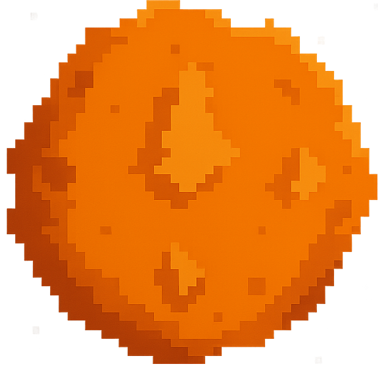

# Astry-Parto
ASTRY Parto is a top-down space shooter where your ship moves forward automatically. Use one button to rotate (double-tap to dash) and another to shoot. Battle other ships and be the last one standing.
## Requirements

Before you run the game, make sure you have:

- pygame>=2.1.0
- matplotlib>=3.5.0
- pandas>=1.3.0
- numpy>=1.21.0

---

## Installation

1. **Clone the repository** (or download the project folder):
   ```bash
   git clone https://github.com/negativeix/Astry-Parto.git
   cd astro-party 
2. **Set up env**
   ```bash
   python -m pip install -r requirements.txt

3. **Start game**
   ```bash
   python game.py

## 🕹️ How to Play
Your spaceship **moves forward automatically at all times** and **starts with a shield**. You only control the direction and actions using two keys:


| **Key**   | **Action**                               | **Type**          |
|-----------|------------------------------------------|-------------------|
| `A`       | Rotate spaceship (CW or CCW based on state) | Hold-to-rotate    |
| `A` x2    | Dash forward                              | Double tap        |
| `D`       | Shoot bullet                              | Tap               |


### ⚔️ **Combat Mechanics**

- If you're hit by an enemy bullet without a shield, your ship is destroyed.
## 🔋 Power-Ups

Destroying orange asteroids  may release special power-ups. Each has a unique effect:

| Icon                                       | Name     | Effect                                                                 |
|--------------------------------------------|----------|------------------------------------------------------------------------|
|    | **Laser**   | Next shot becomes a powerful laser beam.                        |
|   | **Shield**  | Grants a shield that blocks one hit.                            |
|   | **Spread**  | Next 3 shots will fire in a spread pattern.                     |
|  | **Reverse** | Switches game rotation: CW ↔ CCW.                               |


## UML diagram


## 🔗 Other Sources

- 🎥 **Gameplay Demo / Tutorial** (YouTube):  
  [Watch on YouTube](https://youtu.be/9WL7NZx5jIY)

- 📘 **UML Diagram** (in case the above picture didn't work): 
  [View UML Diagram](https://drive.google.com/file/d/1RypMokZFvQKaRNaDlRjYir6YzV15K07g/view?usp=sharing)
